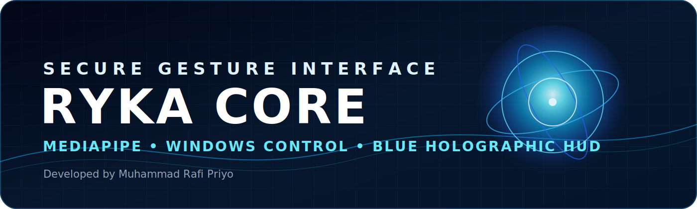
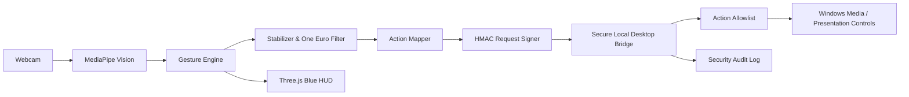
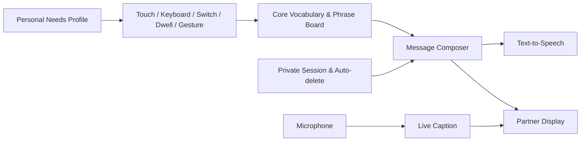

<div align="center">
  

  <br />

  
  
  
  
  

  <h3>Antarmuka kontrol gestur dengan modul komunikasi aksesibel, HUD holografik biru, dan Desktop Bridge yang diperkeras.</h3>

  <p>
    <strong>MediaPipe hand tracking</strong> • <strong>Three.js orb</strong> •
    <strong>gesture-to-text</strong> • <strong>quick phrase board</strong> •
    <strong>live caption</strong> • <strong>text-to-speech</strong> • <strong>HMAC-secured local bridge</strong>
  </p>
</div>

---

## Tentang RYKA CORE

**RYKA CORE** adalah proyek eksperimen Human–Computer Interaction yang memungkinkan pengguna membaca gestur tangan melalui kamera, menampilkan telemetri secara real-time, mengendalikan visual holografik, dan mengirim tindakan tertentu ke Windows.

Versi **4.4 Personal Access & Partner Communication** mempertahankan seluruh fitur penting dari **Rafi HandMotion Modified**, RYKA CORE 4.3, dan Secure Desktop Bridge. Versi ini menambahkan **RYKA Access**, yaitu modul komunikasi lokal untuk gesture-to-text, quick phrase board, text-to-speech, live caption, conversation mode, visual sound alert, dan emergency communication tanpa koneksi ke NusaMind AI.

> Proyek ini dikembangkan oleh **Muhammad Rafi Priyo** sebagai proyek portofolio dan riset pribadi. Tampilan futuristiknya merupakan desain orisinal dan tidak menggunakan aset resmi Marvel, Iron Man, Jarvis, atau Ultron.


## RYKA Access — Personal Access 4.4

RYKA Access adalah mode komunikasi mandiri yang berjalan lokal di RYKA CORE. Fitur ini ditujukan sebagai fondasi alat bantu komunikasi bagi pengguna nonverbal, pengguna dengan hambatan bicara, pengguna Tuli, dan pengguna dengan hambatan pendengaran.

Fitur utama:

- **Personal Needs Setup:** kebutuhan, lingkungan, tangan dominan, dukungan baca, dan role mode.
- **Alternative Input:** touch/mouse, keyboard, single-switch scanning, dwell selection, dan gestur.
- **Stable Core Vocabulary:** 24 kata pada posisi tetap untuk menyusun kalimat visual.
- **Gesture-to-Text:** gestur stabil dipetakan ke kalimat pribadi.
- **Quick Phrase Board:** kebutuhan dasar, percakapan, perasaan, kesehatan, aktivitas, dan darurat.
- **Partner Display:** pesan layar penuh, rotate 180°, status menunggu, dan tombol Ya/Tidak.
- **Communication Partner Guide:** panduan singkat berkomunikasi dengan hormat dan memberi waktu menjawab.
- **Low-Tech Fallback:** kartu komunikasi TXT serta print/save PDF melalui browser.
- **Text-to-Speech:** pesan dapat dibacakan menggunakan suara sistem.
- **Live Caption Foundation:** label pembicara, confidence, ukuran caption, dan export TXT.
- **Conversation Mode:** caption lawan bicara dan jawaban pengguna tampil dalam satu layar.
- **Visual Sound Alert:** peringatan visual berdasarkan tingkat suara keras.
- **Health & Emergency Pack:** kalimat kesehatan dan body map sederhana.
- **Privacy Center:** Private Session, auto-delete riwayat, dan kontrol penghapusan data.
- **Personal Gesture Profile:** mapping gestur dapat diedit, diuji, diekspor, dan diimpor.
- **Accessible Display:** teks besar, kontras tinggi, reduced motion, dan kontrol berukuran besar.
- **Local-first:** tidak ada integrasi NusaMind AI dan tidak ada penyimpanan rekaman audio/video secara default.

Dokumentasi lengkap: [`ACCESSIBILITY.md`](ACCESSIBILITY.md).

> RYKA Access belum merupakan penerjemah BISINDO/SIBI, perangkat medis, atau pengganti tenaga profesional.

## Fitur utama

### Vision Core

- Pelacakan tangan real-time menggunakan MediaPipe.
- GPU delegate dengan fallback CPU.
- Dukungan maksimum **1–4 tangan**.
- Deteksi tangan kiri/kanan dan confidence score.
- Toggle kamera, skeleton, landmark, dan mirror.
- Pilihan kualitas kamera: Performance, Balanced, dan Quality.
- Tampilan Composite, Skeleton Only, dan Clean Camera.

### Gesture Intelligence

- Gesture statis bawaan MediaPipe.
- Dynamic swipe: kiri, kanan, atas, dan bawah.
- Weighted multi-frame stabilization.
- One Euro Filter untuk mengurangi jitter.
- Confidence threshold, hold duration, dan cooldown.
- Release-required dan anti-double-trigger.
- Profile Presentation, Media, dan Custom.
- Gesture Action Mapper.

### Legacy Visual Effects

Seluruh efek dari Rafi HandMotion Modified tetap tersedia:

- **Blur Field**
- **Mosaic Grid**
- **Flip 180°**
- Mode otomatis atau manual.
- Area satu tangan, dua tangan, atau otomatis.
- Intensitas blur dan ukuran blok mosaic dapat diatur.

### RYKA Interface

- Orb holografik biru berbasis Three.js.
- Rotasi orb menggunakan pinch satu tangan.
- Zoom orb menggunakan dua tangan.
- Mode Command, Minimal, dan Debug.
- FPS, inference time, gesture state, dan action log.
- Export log ke JSON dan CSV.

### Windows Desktop Control

- Next/previous slide.
- Play/pause media.
- Mute.
- Volume naik/turun.
- Next/previous track.
- Emergency stop.

> Desktop action hanya menerima perintah yang terdapat dalam allowlist. RYKA CORE tidak menyediakan eksekusi PowerShell mentah dari antarmuka pengguna.

## Security Hardening (dipertahankan dari 4.2)

Desktop Bridge lokal dilindungi menggunakan:

- Token bootstrap acak 256-bit pada setiap sesi.
- Session token berumur pendek.
- HMAC-SHA256 request signing.
- Timestamp validation.
- Nonce replay protection.
- Validasi Origin dan Host.
- Request body limit.
- Rate limiting dan temporary lockout.
- Permission Center untuk command presentation/media.
- Rotating security audit log.
- Emergency stop menggunakan `Ctrl + Shift + F12`.
- CSP dan security headers pada development server.
- Dependency langsung dikunci ke versi spesifik.
- GitHub CodeQL, Dependency Review, Gitleaks, Dependabot, npm audit, test, dan build workflow.

Dokumentasi keamanan:

- [`SECURITY.md`](SECURITY.md)
- [`SECURITY_HARDENING.md`](SECURITY_HARDENING.md)
- [`THREAT_MODEL.md`](THREAT_MODEL.md)
- [`DESKTOP_BRIDGE.md`](DESKTOP_BRIDGE.md)

## Arsitektur



Alur RYKA Access 4.4:



## Persyaratan

- **Windows 10 atau Windows 11** untuk Desktop Mode.
- **Node.js 22 atau lebih baru**.
- **npm 10 atau lebih baru**.
- Kamera/webcam.
- Google Chrome atau Microsoft Edge terbaru.
- Internet pada proses instalasi dependency dan pemuatan model MediaPipe.

Periksa versi:

```powershell
node --version
npm --version
```

## Cara menjalankan

### Metode tercepat — RYKA Access

Klik dua kali:

```text
START_ACCESS.bat
```

Atau buka setelah server aktif:

```text
http://localhost:3200/?mode=access
```

Dari tampilan utama, tekan tombol **ACCESS** atau keyboard **A**.

### Metode 1 — Desktop Mode

Desktop Mode mengaktifkan seluruh fitur, termasuk kontrol Windows.

1. Unduh atau clone repository.
2. Buka folder project yang berisi `package.json`.
3. Klik dua kali:

```text
START_DESKTOP.bat
```

4. Tunggu sampai Vite dan Secure Desktop Bridge aktif.
5. Buka:

```text
http://localhost:3200
```

6. Izinkan akses kamera pada browser.

Terminal harus tetap terbuka selama aplikasi digunakan.

### Metode 2 — PowerShell

```powershell
git clone https://github.com/muhrafi-fsdev/RYKA-CORE.git
cd RYKA-CORE
npm install
npm run dev:desktop
```

Kemudian buka:

```text
http://localhost:3200
```

### Metode 3 — Web-only Mode

Mode ini menjalankan kamera, gesture, orb, skeleton, blur, mosaic, dan flip tanpa mengendalikan Windows.

```powershell
npm install
npm run dev
```

Atau klik:

```text
START_WEB.bat
```

## Kontrol utama

| Input | Aksi |
|---|---|
| Closed Fist, tahan ±1,2 detik | Mengaktifkan gesture control |
| Open Palm, tahan ±1,2 detik | Mengunci gesture control |
| Pinch satu tangan + gerakkan | Memutar orb |
| Pinch dua tangan + ubah jarak | Zoom orb |
| Swipe | Menjalankan action sesuai profile |
| `Ctrl + Shift + F12` | Emergency stop desktop action |
| `G` | Toggle tracking |
| `A` | Membuka/menutup RYKA Access |
| `Alt + S` | Membacakan pesan RYKA Access |
| `Alt + P` | Membuka Partner Display |
| `Space` / `Enter` | Memilih sorotan Single-switch |
| `1`–`9` | Memilih quick phrase pada Keyboard Mode |
| `Escape` | Menutup Partner Display atau dialog |
| `P` | Toggle system panel |
| `R` | Reset orb |
| `1`, `2`, `3` | Command, Minimal, Debug view |

## Script yang tersedia

| Perintah | Fungsi |
|---|---|
| `npm run dev` | Menjalankan Web UI pada port 3200 |
| `npm run dev:desktop` | Menjalankan Web UI dan Secure Desktop Bridge |
| `npm run build` | Membuat production build |
| `npm run preview` | Menampilkan hasil production build |
| `npm run test` | Menjalankan unit test |
| `npm run validate:compat` | Memeriksa kompatibilitas fitur lama dan baru |
| `npm run security:static` | Pemeriksaan keamanan statis lokal |
| `npm run security:bridge-test` | Menguji Secure Desktop Bridge |
| `npm run security:audit` | Menjalankan npm vulnerability audit |
| `npm run security:check` | Menjalankan rangkaian validasi keamanan, test, dan build |

## Pemeriksaan keamanan lokal

Klik:

```text
START_SECURITY_CHECK.bat
```

Atau jalankan:

```powershell
npm run security:check
```

Security audit log disimpan secara lokal di:

```text
logs/security-audit.jsonl
```

Folder `logs/` tidak perlu diunggah ke repository.

## Struktur project

```text
RYKA-CORE/
├─ .github/                 # Security workflow dan Dependabot
├─ docs/                    # Aset dokumentasi
├─ public/                  # Manifest dan aset publik
├─ scripts/                 # Desktop Bridge, launcher, dan validator
├─ src/
│  ├─ components/           # UI utama dan hand tracker
│  ├─ lib/                  # Gesture engine, filters, effects, orb
│  ├─ routes/               # Route utama dan demo
│  └─ styles.css            # Styling aplikasi
├─ SECURITY.md
├─ ACCESSIBILITY.md
├─ THREAT_MODEL.md
├─ START_ACCESS.bat
├─ START_DESKTOP.bat
├─ START_WEB.bat
└─ package.json
```

## Troubleshooting

### `npm ERR! enoent Could not read package.json`

Terminal berada di folder yang salah. Pastikan perintah ini menghasilkan `True`:

```powershell
Test-Path .\package.json
```

### Kamera tidak muncul

- Izinkan permission kamera pada browser.
- Tutup aplikasi lain yang sedang memakai kamera.
- Gunakan `http://localhost:3200`, bukan membuka file HTML secara langsung.
- Pilih webcam lain melalui Camera Manager.

### Desktop Bridge tidak tersambung

- Jalankan `npm run dev:desktop`, bukan hanya `npm run dev`.
- Jangan menjalankan `npm run bridge` secara manual tanpa bootstrap token.
- Pastikan port `3210` tidak digunakan aplikasi lain.
- Periksa terminal dan `logs/security-audit.jsonl`.

### Emergency stop aktif

Buka Security Center dan lakukan re-arm setelah memastikan kondisi aman.

### Dependency gagal dipasang

```powershell
Remove-Item node_modules -Recurse -Force -ErrorAction SilentlyContinue
npm cache verify
npm install
```

## Roadmap

- Native desktop migration menggunakan Tauri.
- Pointer, click, drag-and-drop, dan scroll dengan gesture.
- Calibration Wizard.
- Custom Gesture Builder.
- Offline MediaPipe model dan checksum verification.
- Wake word **Hey Ryka**.
- Offline speech-to-text.
- Integrasi NusaMind.

## Dokumentasi tambahan

- [`COMPATIBILITY_CHECKLIST.md`](COMPATIBILITY_CHECKLIST.md)
- [`MODIFIKASI.md`](MODIFIKASI.md)
- [`RESOURCE_REFERENCES.md`](RESOURCE_REFERENCES.md)
- [`THIRD_PARTY_NOTICES.md`](THIRD_PARTY_NOTICES.md)
- [`VALIDATION_REPORT.txt`](VALIDATION_REPORT.txt)

## Catatan privasi

- Video kamera diproses pada perangkat pengguna.
- Aplikasi tidak dirancang untuk mengunggah rekaman kamera ke server RYKA CORE.
- Desktop Bridge hanya bind ke loopback lokal.
- Jangan memasukkan API key, token, atau password ke source code maupun `localStorage`.

## Developer

<div align="center">
  <strong>Muhammad Rafi Priyo</strong><br />
  Junior Full-Stack Developer • AI & Human–Computer Interaction Enthusiast
</div>

---

<div align="center">
  <sub>RYKA CORE 4.4 — Personal Access & Partner Communication</sub>
</div>
